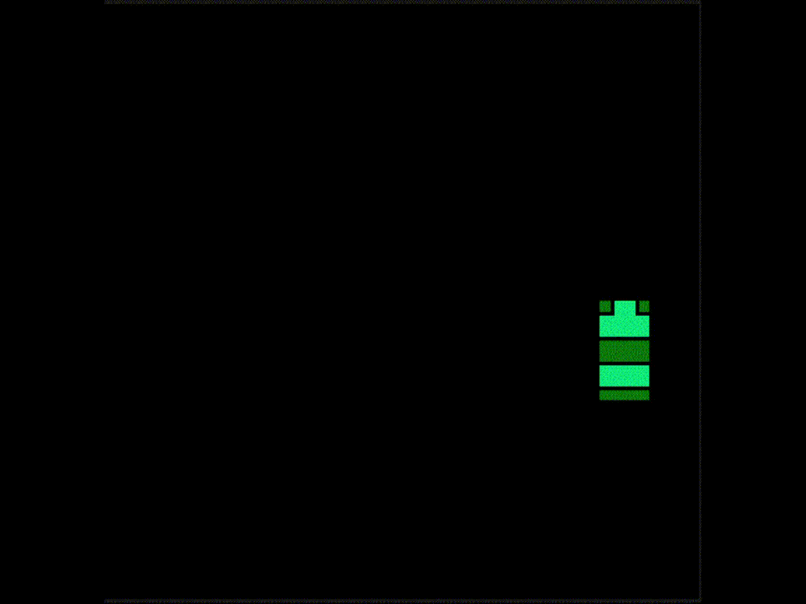

[![Contributors][contributors-shield]][contributors-url]
[![MIT License][license-shield]][license-url]
[![LinkedIn][linkedin-shield]][linkedin-url]

[![Status][badge]](https://github.com/RodrigoQuiroz09/2D-World-Generator-Algorithms)

<!-- PROJECT LOGO -->
 

    
  </a>

<h2 align="center">Wave Function Collapse</h2>

<!-- TABLE OF CONTENTS -->

  
Table of Contents

  <ol>
    <li>
      <a href="#about-the-project">About The Project</a>
      <ul>
        <li><a href="#built-with">Built With</a></li>
        <li><a href="#external-tools">External Tools</a></li>
      </ul>
    </li>
    <li>
      <a href="#requirements">Requirements</a>
    </li>
    <li><a href="#roadmap">Roadmap</a></li>
    <li><a href="#contributing">Contributing</a></li>
    <li><a href="#acknowledgments">Acknowledgments</a></li>
  </ol>

<!-- ABOUT THE PROJECT -->

## About The Project

- Wave Function Collapse is an algorithm for procedural generation of images
- Tile-based image generator build from sprites or sprite sheets
- This is an experiment wiht the WFC Algorithm by Maxim Gumin in Unity.

(<a href="#top">back to top</a>)

### Built With

- [![Unity][unity.com]][unity-url]
- [![C#][csharp.com]][csharp-url]
- [![NET#][net.com]][net-url]

### External tools

- [![Notion][notion.com]][notion-url]
- [![VSCode][vsc.com]][vsc-url]
  - <strong>Core Extensions</strong>
  - C# XML Documentation Comments
  - C# v1.24.4
  
(<a href="#top">back to top</a>)

<!-- GETTING STARTED -->

## Requirements

- Unity Version 2020.2.12f1 or Newer
- C# Programming Language

(<a href="#top">back to top</a>)

<!-- ROADMAP -->

## Roadmap

- Initialization of Data
- Socket Configuration
- Creation of the grid
- Algorithm First Instance

### TO-DO

- Backtracking for Possible tiles in near neighbours (the “wave”)
- Custom selection of tiles in cell
- Buttons for steps

See the [Notion To-Do list](https://silicon-grill-d89.notion.site/a36818ccfc304763abf1f31c1b0e9664?v=e21e954254c84554abdec864099e0c2b) for a full list of proposed features (and known issues).

(<a href="#top">back to top</a>)

<!-- CONTRIBUTING -->

## Contributing

This is a open source game, everyone is invited to take the project as starting project or for reference in certain mechanics.

(<a href="#top">back to top</a>)

<!-- ACKNOWLEDGMENTS -->

## Acknowledgments and Assets

- [WaveFunctionCollapse by mxgmn](https://github.com/mxgmn/WaveFunctionCollapse)
- [The Coding Train - Wave-Function-Collapse](https://secrethideout.itch.io/team-wars-platformer-battle)
- [Wave function collapse: an algorithm inspired by quantum mechanics](https://sudonull.com/post/1592-Wave-function-collapse-an-algorithm-inspired-by-quantum-mechanics)
- [ Oskar Stalberg - Wave](https://oskarstalberg.com/game/wave/wave.html)

## Inspiration

- [#171 — Wave Function Collapse from The Coding Train](https://thecodingtrain.com/challenges/171-wave-function-collapse)

(<a href="#top">back to top</a>)

<!-- MARKDOWN LINKS & IMAGES -->
<!-- https://www.markdownguide.org/basic-syntax/#reference-style-links -->

[contributors-shield]: https://img.shields.io/github/contributors/RodrigoQuiroz09/2D-World-Generator-Algorithms.svg?style=for-the-badge
[contributors-url]: https://github.com/RodrigoQuiroz09/2D-World-Generator-Algorithms/graphs/contributors
[license-shield]: https://img.shields.io/github/license/RodrigoQuiroz09/2D-World-Generator-Algorithms.svg?style=for-the-badge
[license-url]: https://github.com/RodrigoQuiroz09/2D-World-Generator-Algorithms/blob/master/LICENSE.txt
[linkedin-shield]: https://img.shields.io/badge/-LinkedIn-black.svg?style=for-the-badge&logo=linkedin&colorB=555
[linkedin-url]: https://linkedin.com/in/rodrigo-q-3b8213129/
[badge-dev]: https://forthebadge.com/images/badges/built-by-developers.svg
[badge-dev-url]: http://ForTheBadge.com/images/badges/built-by-developers.svg
[product-screenshot]: images/mainmenu.PNG
[unity-url]: https://unity.com
[unity.com]: https://img.shields.io/badge/Unity-100000?style=for-the-badge&logo=unity&logoColor=white
[csharp-url]: https://docs.microsoft.com/en-us/dotnet/csharp/
[csharp.com]: https://img.shields.io/badge/C%23-239120?style=for-the-badge&logo=c-sharp&logoColor=white
[notion-url]: https://www.notion.so/product?fredir=1
[notion.com]: https://img.shields.io/badge/Notion-000000?style=for-the-badge&logo=notion&logoColor=white
[vsc-url]: https://code.visualstudio.com
[vsc.com]: https://img.shields.io/badge/Visual_Studio_Code-0078D4?style=for-the-badge&logo=visual%20studio%20code&logoColor=white
[net-url]: https://dotnet.microsoft.com/en-us/
[net.com]: https://img.shields.io/badge/.NET-5C2D91?style=for-the-badge&logo=.net&logoColor=white
[badge]: https://img.shields.io/badge/Status-Stand--By-orange?style=for-the-badges
